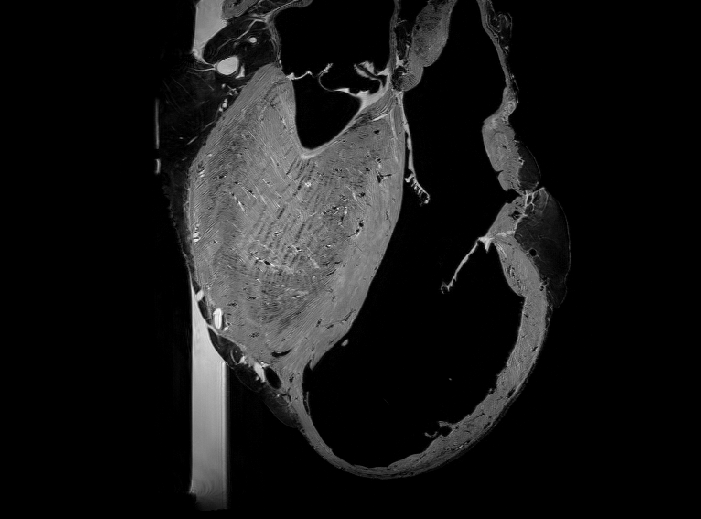
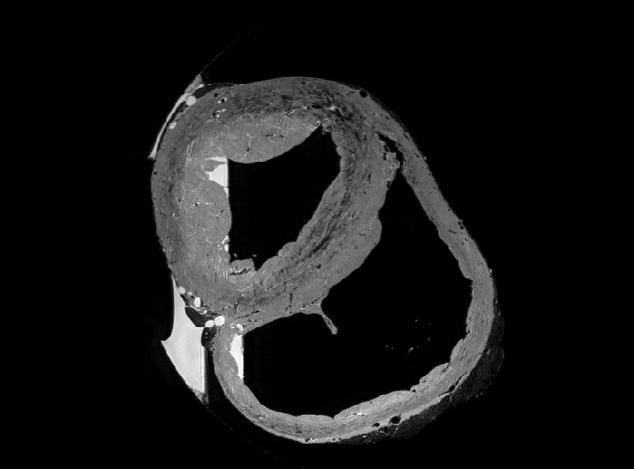
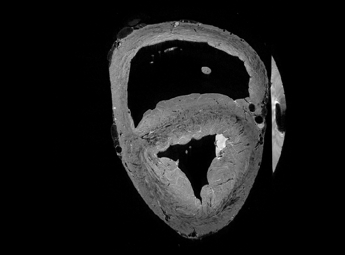
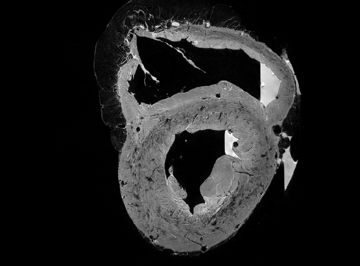
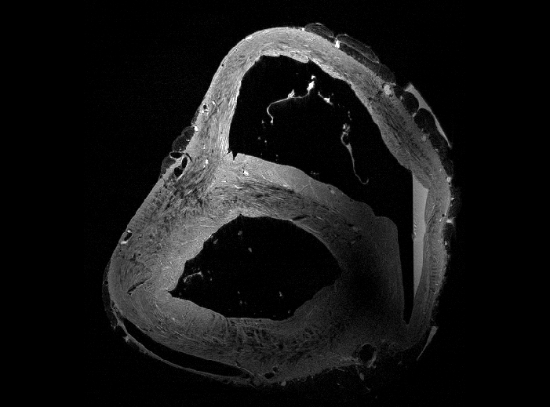

# Cardiac-Structure-Database

Additionnal materials showing the images for the three samples are presented in the webpage. Material and methods are presented in the article available at this in link in MAGMA [here](mettre le lien du journal).

## Heart 1

### Coronal and sagittal view

### Transverse view

## Heart 2

### Coronal and sagittal view

### Transverse view

## Heart 3

### Coronal and sagittal view

### Transverse view

