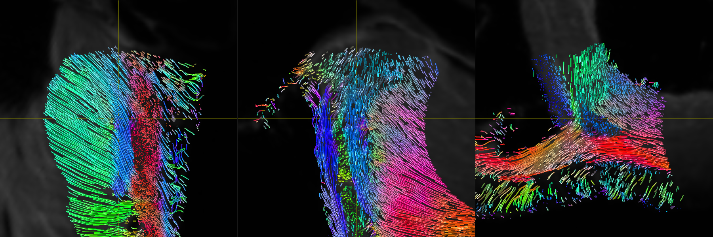
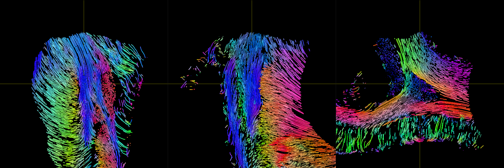
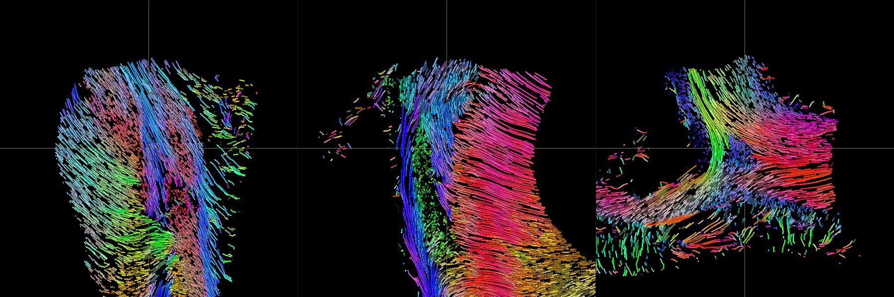

# Cardiac-Structure-Database

Additionnal materials including data and codes for dwi and tractography processing. 

# Environnement

ANTs and MRtrix are mandatory dependencies. 

## OS version

Ubuntu 20.04.2 LTS
 
## MRtrix version
== mrconvert 3.0.2-108-g6844eb03 ==
64 bit release version, built Jun  9 2021, using Eigen 3.3.7
Author(s): J-Donald Tournier (jdtournier@gmail.com) and Robert E. Smith (robert.smith@florey.edu.au)
Copyright (c) 2008-2021 the MRtrix3 contributors.

## ANTs version
ANTs Version: 2.3.5.dev212-g44225
Compiled: Feb  4 2021 11:20:35

## Code 

A code for the computation of the diffusion tensor metric and streamlines is available.  The code is subject to change at any moment. 

## Typical output automatically generated with the code

### Sample 1

### Sample 2

### Sample 3

## Data folder

The data are available on the Zenodo Platform.

.
├── Data
│   ├── 1
│   │   ├── Native
│   │   │   ├── Angles
│   │   │   └── Vectors
│   │   └── Template
│   │       ├── Angles
│   │       ├── Streamlines
│   │       └── Vectors
│   ├── 2
│   │   ├── Native
│   │   │   ├── Angles
│   │   │   └── Vectors
│   │   └── Template
│   │       ├── Angles
│   │       ├── Streamlines
│   │       └── Vectors
│   ├── 3
│   │   ├── Native
│   │   │   ├── Angles
│   │   │   └── Vectors
│   │   └── Template
│   │       ├── Angles
│   │       ├── Streamlines
│   │       └── Vectors
│   └── averaged
│       └── Template
│           ├── Angles
│           ├── Streamlines
│           └── Vectors
├── Figure_4
├── Figure_5
├── Figure_6
├── Figure_8
├── Slicer
└── Warps

