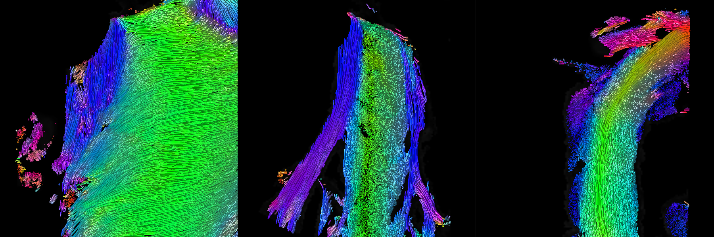
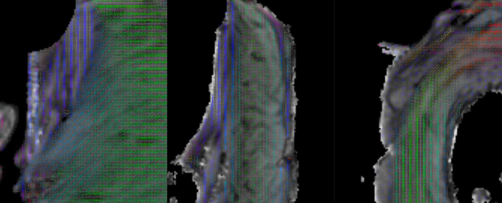
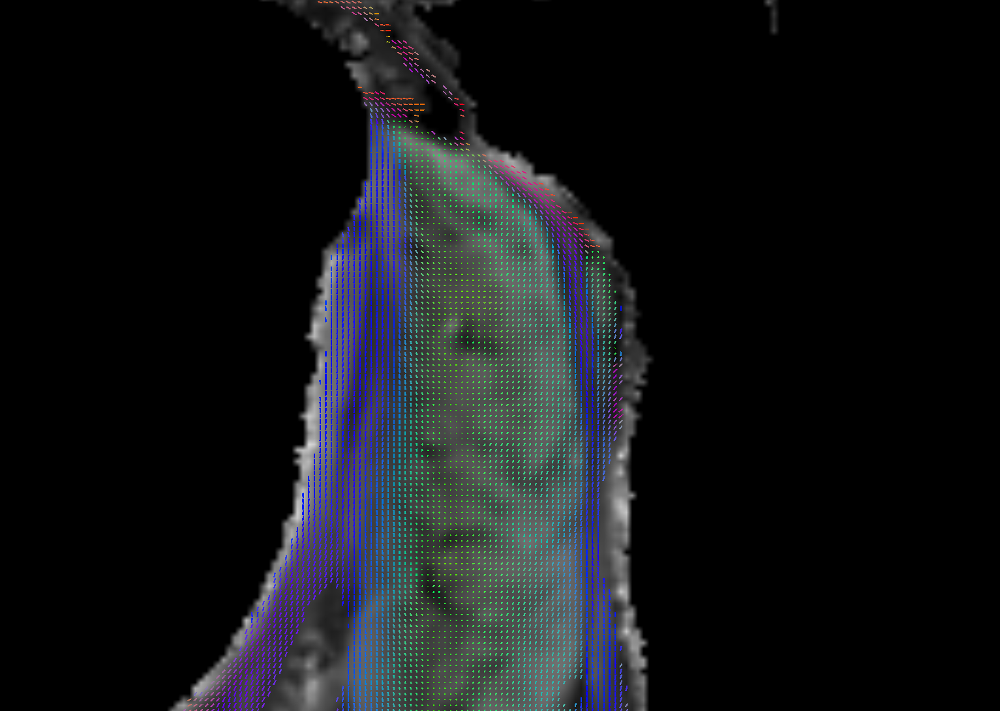
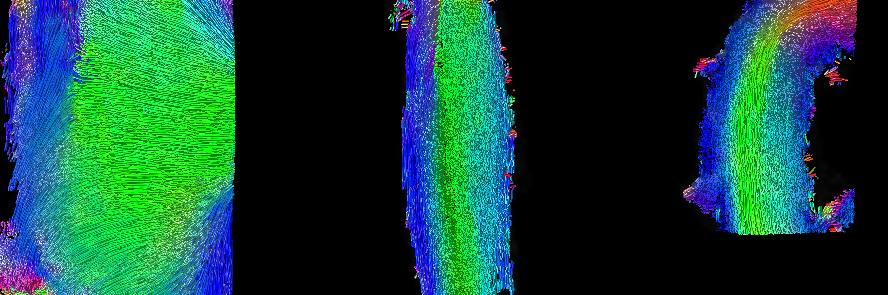

# Cardiac-Structure-Database

Material for the article "Impact of Intraventricular Septal Fiber Orientation on Cardiac Electromechanical Function" have been uploaded on the zenodo platform in December 2021. The link is indicated at the bottom of this page. 

Additionnal materials including data and codes for dwi and tractography processing. 

If you use the data, please cite: 

```

```

# Environnement

ANTs and MRtrix are mandatory dependencies. 

## OS version

Ubuntu 20.04.2 LTS
 
## MRtrix version
== mrconvert 3.0.2-108-g6844eb03 ==
64 bit release version, built Jun  9 2021, using Eigen 3.3.7
Author(s): J-Donald Tournier (jdtournier@gmail.com) and Robert E. Smith (robert.smith@florey.edu.au)
Copyright (c) 2008-2021 the MRtrix3 contributors.

## ANTs version
ANTs Version: 2.3.5.dev212-g44225
Compiled: Feb  4 2021 11:20:35

## Code 

A code for the computation of the diffusion tensor metric and streamlines is available.  The code is subject to change at any moment. 
As an example, the code automatically produces the following figures. 

## Figures


### Human Sample in LA Aligned space




### Sample 1 in template space

### Sample 2 in template space

### Sample 3 in template space



## Data folder

The data are available on the Zenodo Platform.

* v0.1 [](https://doi.org/10.5281/zenodo.5789035) Initial Push 


Data Hierarchy

```
.
├── Human
│   ├── 1
│   │   ├── Aligned
│   │   └── Native
│   └── ROI
└── Sheep
    ├── 1
    │   ├── Aligned
    │   └── Template
    ├── 2
    │   ├── Native
    │   └── Template
    ├── 3
    │   ├── Native
    │   └── Template
    ├── averaged
    │   └── Template
    └── ROI

```


File Hierarchy 

```
.
├── 1
│   ├── Native
│   │   ├── dwi_raw_1_4D.mif
│   │   ├── fa_1.nii.gz
│   │   ├── mask_threshold_1_all.nii.gz
│   │   ├── mean_bzero_1.nii.gz
│   │   ├── Segmentation_1-ready-label_native.nii.gz
│   │   ├── tensor_1_4D.nii.gz
│   │   └── v1_1_masked.nii.gz
│   └── Template
│       ├── fa_1.nii.gz
│       ├── mask_threshold_1_all_to_T_via_ants.nii.gz
│       ├── mean_bzero_1_to_T_via_ants.nii.gz
│       ├── tensor_1_moved_4D_reoriented.nii.gz
│       └── v1_1_moved_reoriented_masked.nii.gz


```


