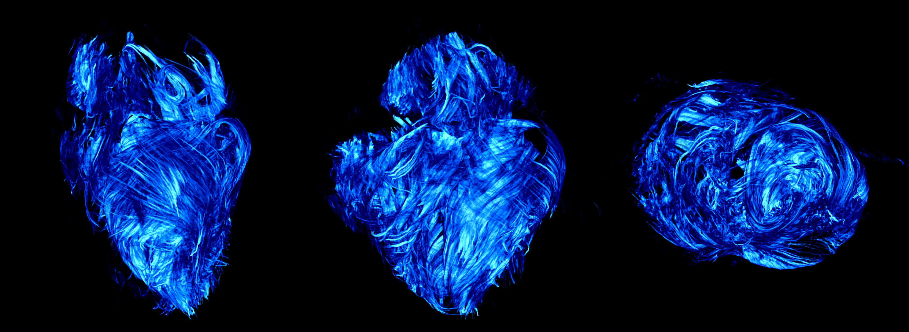

# Cardiac-Structure-Database

[link](Article-1/) to additionnal materials regarding the submission in MAGMA

[link](Article-2/) to additionnal materials regarding the submission in Plos One

[link](Article-3/) to additionnal materials regarding the submission in AJP Heart and Circulatory Physiology 

[link](Article-4/) to additionnal materials regarding the submission in 

[link](Article-5/) to additionnal materials regarding the abstracts submission for FIMH 2023, Lyon, France

[link](Tutorial_for_Lucy/) Tutorial about tensor reorientation