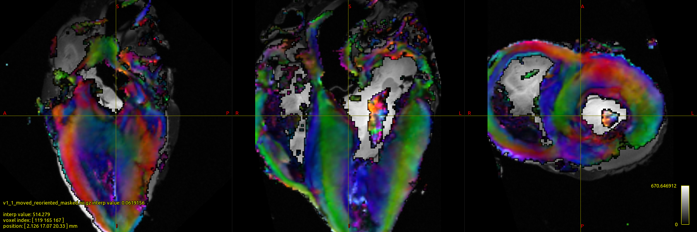

# Tutorial about tensor reconstruction and reorientation using the NC_EPI3D_DIFF sequence  

Here is a brief tutorial for tensor reconstruction and reorientation using the NC_EPI3D_DIFF sequence. Largely inspired from https://github.com/ANTsX/ANTs/wiki/Warp-and-reorient-a-diffusion-tensor-image. The NC_EPI3D_DIFF sequence has been developped by Dr. Nadege Corbin, CNRS, Bordeaux.


# Environnement

ANTs and MRtrix are mandatory dependencies. ITK-SNAP and 3DSlicer may be usefull as well. 

## OS version
```
Distributor ID:	Ubuntu
Description:	Ubuntu 22.04.2 LTS
Release:	22.04
Codename:	jammy
 ```
## MRtrix version
```
valery:~/Dev/Cardiac-Structure-Database$ `mrcalc`` --version
== mrview 3.0.3-98-gb3409159 ==
64 bit release version, built Apr 20 2022, using Eigen 3.3.7
Author(s): J-Donald Tournier (jdtournier@gmail.com), Dave Raffelt (david.raffelt@florey.edu.au), Robert E. Smith (robert.smith@florey.edu.au), Rami Tabbara (rami.tabbara@florey.edu.au), Max Pietsch (maximilian.pietsch@kcl.ac.uk), Thijs Dhollander (thijs.dhollander@gmail.com)
Copyright (c) 2008-2022 the MRtrix3 contributors.
```
## ANTs version
```
valery:~/Dev/Cardiac-Structure-Database$ `antsRegistration`` --version
ANTs Version: v2.3.5.post106-gd0156d3
Compiled: Apr 20 2022 11:20:40
```

## MRI

The NC_EPI3D_DIFF is available via CPP on all VE versions of Siemens MRI. It has been mainly tested on 3T Prisma and Skyra. 

# Context

6 DWI sequences has been acquired on ex vivo sample and are accesible at this "https://mille-feuilles.ihu-liryc.fr/#collection/666afd6021199c3aab754796/folder/678f9e409332b35e6e4dafbf".

Acquisitions were performed with Lucy Kershaw from Centre for Cardiovascular Science and Edinburgh Imaging Facilities and John Keen from The Royal School of Veterinary Studies and The Roslin Institute.

Information must be set in a separate json files in Jsons/. It assummes single shell (here b=1000).
b0 acquisitions in RL/LR or PA/AP has been acquired. TopUp correction and N4Bias correction are not presented here.

# Code 

A  for the computation and reorientation of the diffusion tensor metric is avaible. Jsons file are used to set the DICOM folder name and path in the  folder. The code is subject to change at any moment. As an example, the code automatically produces the following .

The code combine the use of MRtrix for diffusion metric estimation and ANTs for reorientation.
Please run either  `run_all.sh` or

```
./command_extract_tensor.sh ../Jsons/Acquisition1.json
```

A crucial step is the tensor conversion from MRtrix to ANTs format. Two subscripts are in charge of such task.
Please check that /tmp/ folder exist and we have permission in this folder.

Additionnal feature have been developped and could be added upon request.

* TopUp correction
* N4Biais correction
* Generation of streamlines 
* Reorientation of streamlines.
* Non-linear registration of samples
* Atlas / Template approaches for ex-vivo sample hearts.
* Angles, myocardial disarray index calculation

# Notes

Note that high intensity signal is present in the mean b0 images leading to apparent black signal, cut off fix the display issue.

# Jsons

```
{
    "sequence": [
 
       {  "PROJECT_FOLDER":"/workspace_QMRI/PROJECTS_DATA/2025_RECH_EPI3Ddiff_horse/",
          "MAIN_EXAM_FOLDER_NAME":"0115_HORSEHEART_25_01_15-11_43_10-STD-1_3_12_2_1107_5_2_43_66056",
          "SUB_EXAM_FOLDER_NAME": "RMSB_PC_20250115_114338_281000",
          "MRTRIX_FOLDER_NAME":"Mrtrix_Reco_3_RL_seg4_8dir_2.0mm",
          "DIR": 8,
          "BVALUE": 1000,
          "SEQ_AP_B0_FOLDER_NAME": "NC_EPI3D_DIFF_S4_B0_OBL_RL_0007",         
          "SEQ_PA_B0_FOLDER_NAME": "NC_EPI3D_DIFF_S4_B0_OBL_LR_0008",
          "SEQ_AP_BVALUE_FOLDER_NAME": "NC_EPI3D_DIFF_S4_B1000_OBL_RL_0009",         
          "MPRAGE_FOLDER": "3DT1_MPRAGE_0005", 
          "TRANSFORM_ALIGNED": "1/transform_itk_native_to_LA.txt",
          "RESLICED_REFERENCE": "1/resliced_volume_in_LA_space_2.0mm.nii.gz",
          "THRESHOLD":30,
          "FORCE": "0"
       }      
    ]
}    
```    

## Figures

Sample after reorientation


 

 
